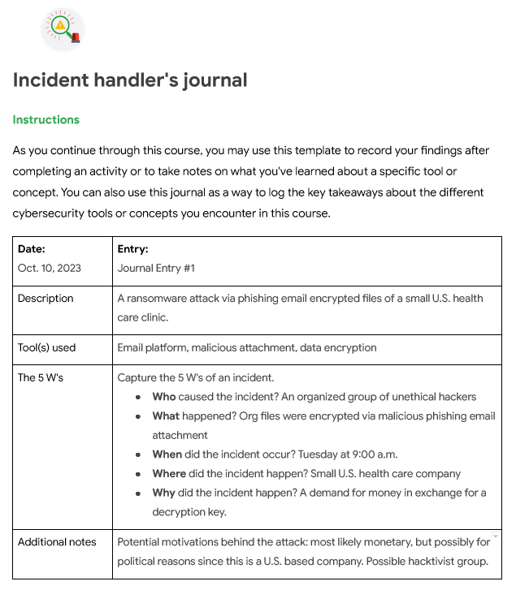

## Security Incident Handler's Journal

### Scenario 1
- A small U.S. health care clinic experienced a security incident on Tuesday at 9:00 a.m. which severely disrupted their business operations.
- The cause of the security incident was a phishing email that contained a malicious attachment. Once it was downloaded, ransomware was deployed encrypting the organization's computer files.
- An organized group of unethical hackers left a ransom note stating that the company's files were encrypted and demanded money in exchange for the decryption key

