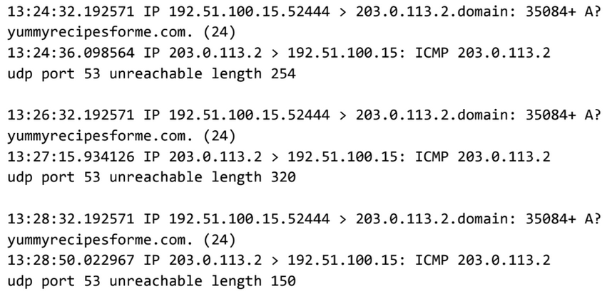

## Mock Incident Report

You are a cybersecurity analyst working at a company that specializes in providing IT consultant services. Several customers contacted your company to report that they were not able to access the company website www.yummyrecipesforme.com, and saw the error “destination port unreachable” after waiting for the page to load. 

You are tasked with analyzing the situation and determining which network protocol was affected during this incident. To start, you visit the website and you also receive the error “destination port unreachable.” Next, you load your network analyzer tool, tcpdump, and load the webpage again. This time, you receive a lot of packets in your network analyzer. The analyzer shows that when you send UDP packets and receive an ICMP response returned to your host, the results contain an error message: “udp port 53 unreachable.” 

In the DNS and ICMP log, you find the following information:

  1. In the first two lines of the log file, you see the initial outgoing request from your computer to the DNS server requesting the IP address of yummyrecipesforme.com. This request is sent in a UDP packet.

  2. Next you find timestamps that indicate when the event happened. In the log, this is the first sequence of numbers displayed. For example: 13:24:32.192571. This displays the time 1:24 p.m., 32.192571 seconds.

  3. The source and destination IP address is next. In the error log, this information is displayed as: 192.51.100.15.52444 > 203.0.113.2.domain. The IP address to the left of the greater than (>) symbol is the source address. In this example, the source is your computer’s IP address. The IP address to the right of the greater than (>) symbol is the destination IP address. In this case, it is the IP address for the DNS server: 203.0.113.2.domain

  4. The second and third lines of the log show the response to your initial ICMP request packet. In this case, the ICMP 203.0.113.2 line is the start of the error message indicating that the ICMP packet was undeliverable to the port of the DNS server.

  5. Next are the protocol and port number, which displays which protocol was used to handle communications and which port it was delivered to. In the error log, this appears as: udp port 53 unreachable. This means that the UDP protocol was used to request a domain name resolution using the address of the DNS server over port 53. Port 53, which aligns to the .domain extension in 203.0.113.2.domain, is a well-known port for DNS service. The word “unreachable” in the message indicates the message did not go through to the DNS server. Your browser was not able to obtain the IP address for yummyrecipesforme.com, which it needs to access the website because no service was listening on the receiving DNS port as indicated by the ICMP error message “udp port 53 unreachable.”

  6. The remaining lines in the log indicate that ICMP packets were sent two more times, but the same delivery error was received both times. 

Now that you have captured data packets using a network analyzer tool, it is your job to identify which network protocol and service were impacted by this incident. Then, you will need to write a follow-up report. 

As an analyst, you can inspect network traffic and network data to determine what is causing network-related issues during cybersecurity incidents. Later in this course, you will demonstrate how to manage and resolve incidents. For now, you only need to analyze the situation. 

This incident, in the meantime, is being handled by security engineers after you and other analysts have reported the issue to your direct supervisor. 

### Cybersecurity Incident Report

