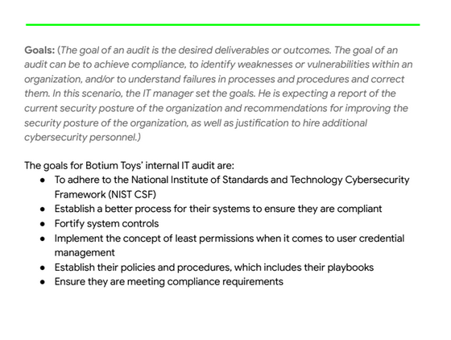
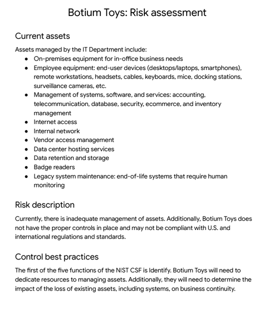

## Mock Security Audit via the Google Cybersecurity Professional Certification.

This scenario is based on a fictional company:

Botium Toys is a small U.S. business that develops and sells toys. The business has a single physical location. However, its online presence has grown, attracting customers in the U.S. and abroad. Their information technology (IT) department is under increasing pressure to support their online market worldwide. 

The manager of the IT department has decided that an internal IT audit needs to be conducted. She expresses concerns about not having a solidified plan of action to ensure business continuity and compliance, as the business grows. She believes an internal audit can help better secure the company’s infrastructure and help them identify and mitigate potential risks, threats, or vulnerabilities to critical assets. The manager is also interested in ensuring that they comply with regulations related to accepting online payments and conducting business in the European Union (E.U.).   

The IT manager starts by implementing the National Institute of Standards and Technology Cybersecurity Framework (NIST CSF), establishing an audit scope and goals, and completing a risk assessment. The goal of the audit is to provide an overview of the risks the company might experience due to the current state of their security posture. The IT manager wants to use the audit findings as evidence to obtain approval to expand his department. 

Your task is to review the IT manager’s scope, goals, and risk assessment. Then, perform an internal audit to complete a controls assessment and compliance checklist. 

### Botium Toys: Audit Scope and Goals

### Botium Toys: Risk Assessment

*You receive the following email from your IT manager:*

> Hello!
> 
> I have completed the audit scope and goals, as well as a risk assessment. At a high level, the main goals and risks are as follows:
> #### Goals:
> - Improve Botium Toys’ current security posture by aligning to industry best practices (e.g., adhere to the NIST CSF, implement concept of least permissions)
> - Provide mitigation recommendations (i.e., controls, policies, documentation), based on current risks
> - Identify compliance regulations Botium Toys must adhere to, primarily based on where we conduct business and how we accept payments
> - To review the full report, read the Botium Toys: Audit scope and goals document
>
> #### Risks:
> - Inadequate management of assets
> - Proper controls are not in place
> - May not be compliant with U.S. and international regulations and guidelines
> - Current risk score is 8/10 (high), due to a lack of controls and adherence to compliance regulations and standards
>
> To review the complete list of assets and risks, read the Botium Toys: Risk assessment document
> 
> Thank you,
> 
> Botium Toys IT Manager

After you review the audit scope, goals, and risk assessment, consider the following questions:

  What are the biggest risks to the organization? 
  
  ***The biggest risks to the organization are:***
  - Compliance through U.S. and international regulations.
  - Access to PII (Personally Identifiable Information) of customers/vendors/employees.
  - Employee access permissions. (separation of duties)

  Which controls are most essential to implement immediately versus in the future?

  ***The most essential controls to implement immediately are:***
  - Ensuring compliance through external criteria. In this instance since Botium is selling outside of the United States, regards to the GDPR (General Data Protection Regulation) will need to be made.
  - Internal network firewall to safeguard PII for all customers/vendors.
  - Keeping up to date with physical security measures such as IP cameras and badge readers to protect physical assets that help with business continuity.

  Which compliance regulations does Botium Toys need to adhere to, to ensure the company keeps customer and vendor data safe, avoids fines, etc.?

  ***The compliance regulation that Botium Toys needs, since they distribute to customers outside of the U.S., is the General Data Protection Regulation (GDPR) per the European Union.***

  ### Botium Toys: Compliance Checklist

  
  

  
